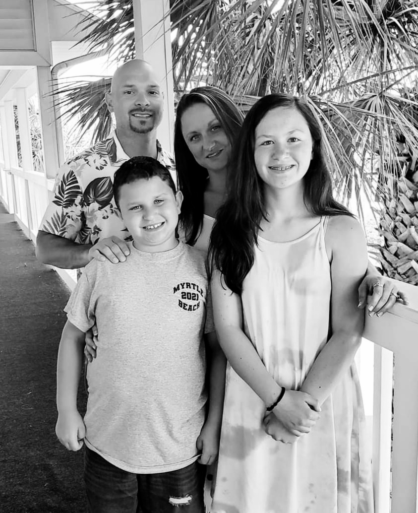

# <b> Hello World </b>

 My Name is Lauren. I have worked as a Data Center Technician with Microsoft for 4 years, and have recently been accepted into the Leap Program. I am very grateful for this opportunity, and look forward to learning all this program has to offer. 

# <i> On Github I am: </i>
<ul>
<li>Learning how to create branches, merges, and remotes. </li>
<li>Learning how to create my public profile. </li>
</ul>

# <i> I Enjoy: </i>
<ul>
<li> Being in the Leap Program </li>
<li> Reading </li>
<li> Painting </li>
<li> Being a mom </li>
</ul>

# <i> Professional: </i>
<ul>
<li><b> Currently as a Technician I am:</b>
<li> Responsible for effectively prioritizing daily assignments of tasks and tickets based on business requirements. </li>
<li>Focused on flexibility to support the Datacenter in any capacity when called upon.</li>
<li> Take pride in providing outstanding customer service through highly developed communication skills. </li>
<li> Ensure processes and procedures are followed, and that trust and integrity is maintained per Microsoft Global Foundation Services policy.</li>
 
<li><b> As a current Leaper:</b> </li>
<li> Completed Git Essential Training </li>
<li> Completed HTML Essential Training </li>
<li> Completed Git: Branches, Merges, and Remote </li>
</ul>

<b> Contact </b>

<a href="www.linkedin.com/in/lauren-ryder-00675617b"> Lauren's Linkedin</a>
